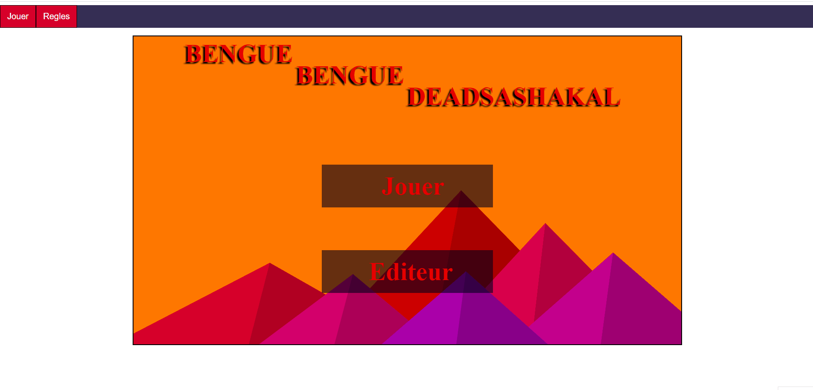
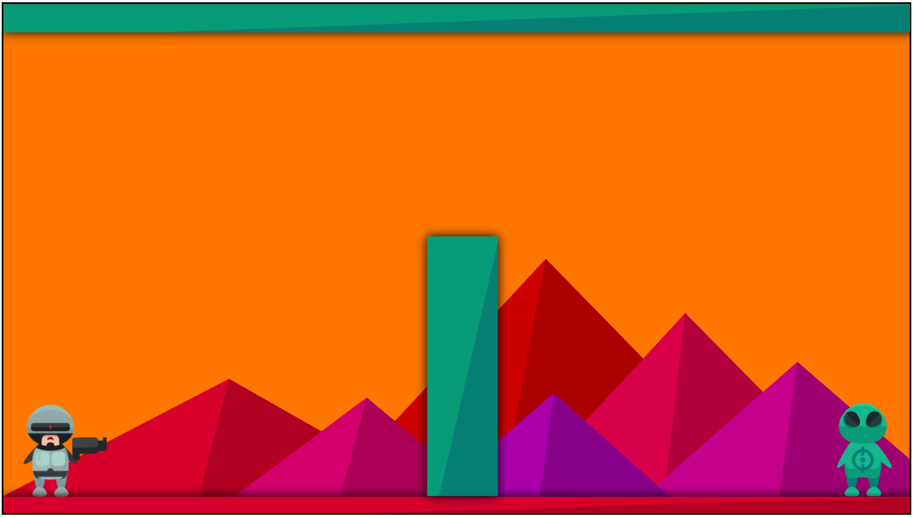
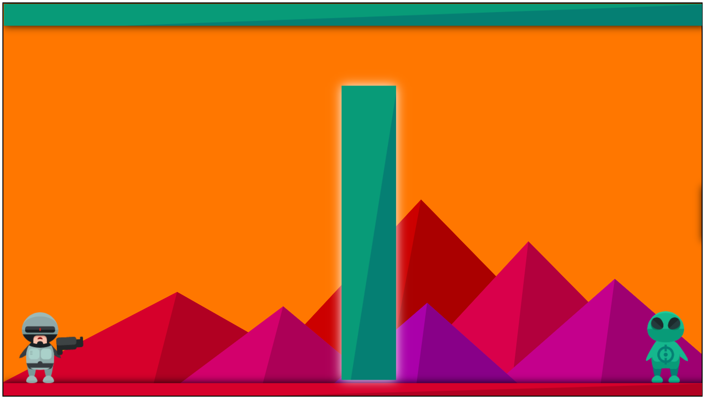

# Bengue bengue deadSaShakal
participants:  
-Mathieu Birger 
-Valentin Bordy   

<h1>Explication des règles.</h1>

Pour une expérience optimale nous conseillons d'utiliser le navigateur Chrome ou un navigateur se basant sur chromium, des problèmes existent sur les autres navigateurs qui n'accueillent pas certaines fonctionnalités des canvas que nous avons utilisé. 
Voici une démo d'un niveau du jeu avec un navigateur suportant les fonctionnalités: 

Merci de votre compréhension.

<h2>Le but du jeu:</h2>

Le but du jeu est simple vous êtes un hero  et votre but et d'éliminer les ennemis  
à travers différents niveaux à l'aide de rebond sur les différents murs et obstacles. 

<b>Attention !</b> les balles sont limités tout comme le nombre de rebonds.

<h2>L'éditeur de niveau : </h2>

L'editeur de niveau va vous permettre de créer vos propres niveaux et de les importer. 
  
Voici une liste des actions réalisables avec l'éditeur de niveau:   
-Sélectionner les objets à placer avec les touches :
A Z T (mur) - 
E (hero) - 
R (Ennemie) 
-Placer les objets avec clique gauche.  
-Clique droit supprime l'objet placé.  
-Clique gauche sur un objet placé pour le sélectionner. Il devient alors surbrillant. 
-Pour modifier la taille de l'objet sélectionné utiliser le slider de droite pour la hauteur, le slider du bas pour la largeur.
 
-Pour déplacer un objet déjà placé: Le sélectionner puis cliquer dessus sans relacher le clique et le déplacer avec la souris. 
-Pour tester la map il faut appuyer sur la touche P. 
-Pour quitter le test il faut appuyer sur la touche P. 
-Pour sauvegarder la map il faut appuer sur la touche S. 
-Pour charger une map il faut appuyer sur la touche W. 

